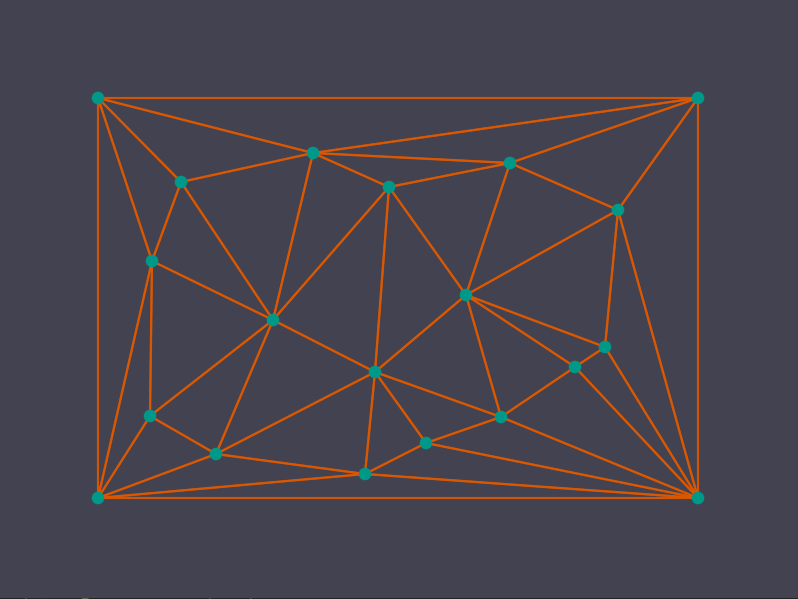

# Delaunay triangulation
Hi! Here we are creating non-constrained Delaynay triangulation and drawing scene with OpenGL shaders. It is  platform independent solution written on C++.

### Control
* Add point - right mouse click     
* Move point - left mouse drag&drop
* R - hot reload shaders
* B - rebuild triangulation

### Example

### Details
* The approach described by S. W. Sloan in his [article](./data/articles/A-fast-algortithm-for-generating-constrained-Delaunay-triangulations.pdf) is implemented.
* The [book](.data/articles/SkvortsovAV-DT.pdf) by Skvortsov A.V. contains a lot of important datails.
* Draw smooth points and lines. Go deep into the code of shaders. Here is an example of pretty simple architecture and clean code.
* Use `glad` and `glfw` libraries for graphics and `glm` for math operations. All libraries already included.

### History
Mathematics theory was described by Russian scientist Boris Delaunay in 1934. The generation algorithm was invented in 1992 in Newcastle University, Australia by S. W. Sloan. And in 2022 we implemented algorithms in C++ for this approach in Russia again. Knowledge will always be relevant.

